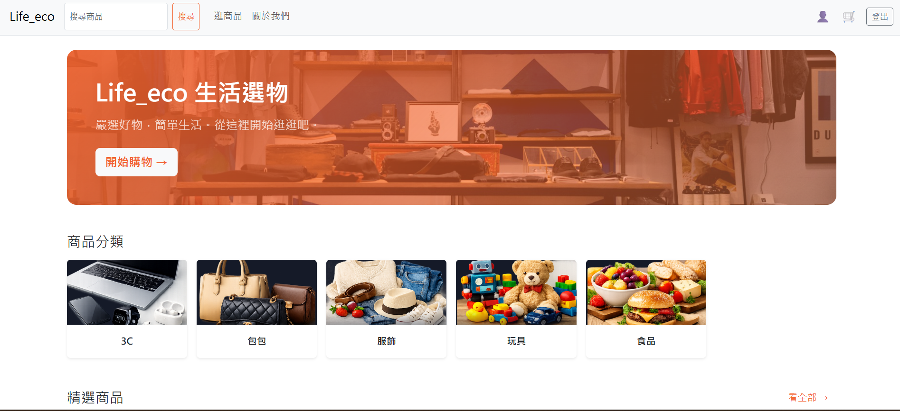
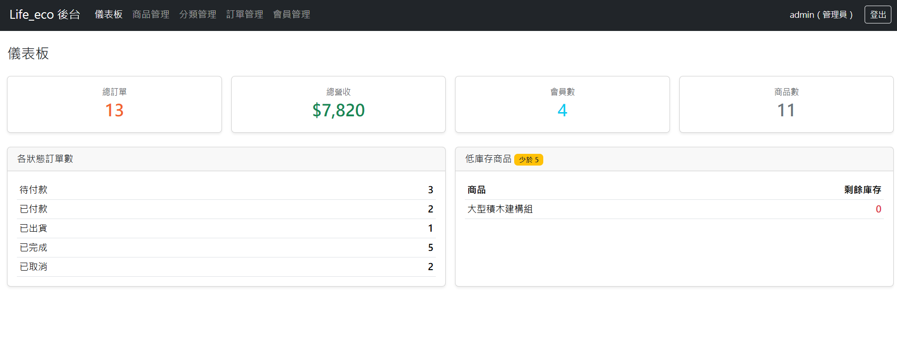
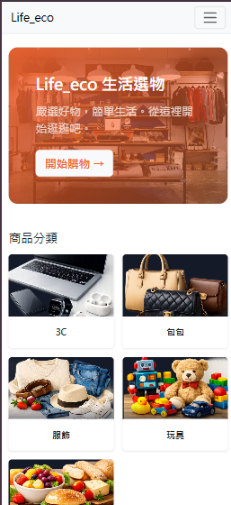

# Life_eco 電商平台

一個前後端分離的全端電商專案，包含 **顧客端 API** 與 **React 後台管理系統**。
重點放在「乾淨的 API 設計 + 完整的自動化測試 + 角色權限控管」，呈現具備測試思維的後端開發能力。

> 作者：**Michelle**　|　這是一個學習與作品集專案，開發過程有借助 AI 工具輔助。

---

## 🔗 Live Demo

- 🛍️ **線上 Demo（前端）**：<https://life-eco.vercel.app>
- ⚙️ **後端 API**：<https://life-eco.onrender.com>
- 📖 **API 文件（Swagger）**：<https://life-eco.onrender.com/swagger/>

> ⏳ 後端部署在 Render 免費方案，閒置一段時間會休眠，**第一次開啟可能需等約 30～50 秒**喚醒，屬正常現象。

---

## 🖼️ 畫面預覽

### 顧客端首頁


### 後台儀表板


### 手機版（RWD）


---

## ✨ 主要功能

### 顧客端 API
- 會員註冊 / 登入（JWT 認證）
- 商品瀏覽、關鍵字搜尋、分頁
- 購物車一次成立訂單（自動計算總價、扣庫存、價格快照、交易整筆回滾）
- 模擬金流付款（mock，已預留 Stripe 測試模式接口）
- 查詢自己的訂單與付款

### 後台管理（React）
- 管理員登入（驗證 `is_staff`）
- 📊 **儀表板**：總訂單 / 營收 / 會員數 / 低庫存提醒
- 📦 **商品管理**：新增 / 編輯 / 刪除、搜尋、分頁、**多圖上傳（最多 3 張）**
- 📋 **訂單管理**：狀態篩選、客人搜尋、查看明細、推進狀態（出貨 / 完成）、取消（自動回補庫存 + 退款）
- 👥 **會員管理**：編輯 Email、啟用 / 停用帳號

---

## 🛠️ 技術棧

| 範疇 | 技術 |
|------|------|
| 後端 | Python、Django、Django REST Framework |
| 認證 | JWT（djangorestframework-simplejwt） |
| 資料庫 | MySQL（本機開發）／ PostgreSQL（正式環境，Supabase） |
| API 文件 | drf-yasg（Swagger / ReDoc） |
| 前端 | React、Vite、React Router、Redux Toolkit + RTK Query、Bootstrap |
| 測試 | Django `APITestCase`（101 個自動化測試） |
| 部署 | 前端 Vercel、後端 Render（gunicorn + WhiteNoise）、資料庫 Supabase |

---

## 📁 專案結構

```
Life_eco/
├── ecommerce/            # Django 後端
│   ├── products/         # 商品（含商品圖片）
│   ├── orders/           # 訂單、訂單項目
│   ├── payments/         # 付款（mock 金流）
│   ├── user/             # 會員、註冊 / 登入
│   ├── dashboard/        # 後台統計 API
│   ├── ecommerce/        # 專案設定
│   └── manage.py
├── frontend/             # React 後台管理
│   └── src/
│       ├── features/     # RTK Query API 層、auth
│       ├── pages/        # 各管理頁
│       └── components/   # 共用元件
├── requirements.txt
└── README.md
```

---

## 🚀 本地執行

### 1. 後端

需先安裝並啟動 MySQL，建立資料庫 `ecommerce_db`。

```bash
cd ecommerce
python -m venv ../venv
../venv/Scripts/activate        # Windows
pip install -r ../requirements.txt

# 設定環境變數：複製範本後填入自己的值
cp .env.example .env            # 再編輯 .env

python manage.py migrate
python manage.py createsuperuser
python manage.py runserver       # http://127.0.0.1:8000
```

環境變數（`.env`）：

| 變數 | 說明 |
|------|------|
| `DJANGO_SECRET_KEY` | Django 金鑰 |
| `DJANGO_DEBUG` | `True` / `False` |
| `DB_NAME` / `DB_USER` / `DB_PASSWORD` / `DB_HOST` / `DB_PORT` | MySQL 連線 |
| `STRIPE_SECRET_KEY` | Stripe 測試金鑰（之後串金流用） |

### 2. 前端

```bash
cd frontend
npm install
npm run dev                      # http://localhost:5173
```

---

## 🧪 測試

以「風險導向 + 分層」設計測試：每個 API 都涵蓋**正向、負向、邊界、權限**四種情境，並把測試重心放在有商業邏輯的地方（金流、庫存、交易一致性）。目前共 **101 個自動化測試**（Django `APITestCase`），全數通過。

```bash
cd ecommerce
# 用測試專用設定：in-memory SQLite，與正式資料庫隔離、不需啟動 MySQL，約 0.7 秒跑完
python manage.py test --settings=ecommerce.test_settings
```

📋 完整測試案例設計（含前置條件、步驟、預期結果）整理於 **[TEST_CASES.md](./TEST_CASES.md)**。

### 幾個代表性案例

| 測試重點 | 情境 | 驗證什麼 |
|----------|------|----------|
| 交易一致性 | 多品項訂單中某項庫存不足 | 回 400 且**整筆回滾**——已扣的庫存還原、不留半成品訂單，避免超賣 |
| 價格快照 | 訂單成立後商品再漲價 | 舊訂單的總價與品項單價維持下單當下的值，不受影響 |
| 越權存取 | 使用者查別人的訂單 | 回傳 **404 而非 403**，不洩漏「該資源是否存在」 |
| 信任邊界 | Stripe 付款金額被前端竄改 | 後端回頭向 Stripe 查證金額與幣別，不符則擋下、訂單維持未付款 |
| 自我鎖定防護 | 管理員嘗試停用自己的帳號 | 兩個入口（停用 API、編輯會員）都擋下，避免把自己鎖在門外 |

> 測試環境使用 in-memory SQLite 而非正式資料庫，確保測試快速、可重複、且不影響任何真實資料。

## 📖 API 文件

啟動後端後：
- Swagger UI：http://127.0.0.1:8000/swagger/
- ReDoc：http://127.0.0.1:8000/redoc/

---

## 📌 備註
- 金流目前為 mock（模擬一律成功），程式內已標好串接 Stripe 測試模式的位置。
- 商品圖片已隨 repo 一起版控，正式環境由 WhiteNoise 在 WSGI 層提供；後台新上傳的圖片屬本機/暫存，未串雲端物件儲存。
